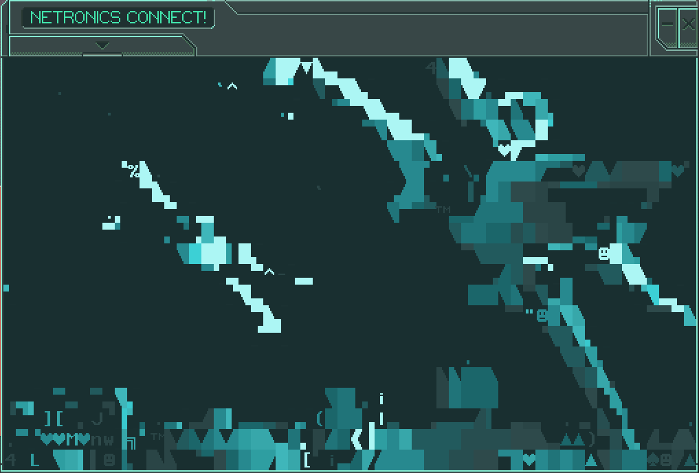

# LC BBS Video Player
This is both a player and encoder of video. Put in a video file, and a javascript file gets spit out, ready to render that video in stunning detail on the Sawayama Powerlance.

This video encoding and playback is powered by variable frame timings, and RLE compression.

This project is inspired by the work of [ethanhjennings](https://github.com/ethanhjennings/last-call-bbs-video-player), who made a funnier joke than I ever will.

# Controls

Space - Play/Pause

Left/Right - Change frames

Anything Else - Toggle UI

# How To Use

To make your own servers (in order words, videos to play in Last Call BBS) you must drag and drop video files into video.py.
If you don't like dragging and dropping, you can run it in command line by providing a video file as the first argument. There are no other command line options. (even though there should be.)

 Encoding can... take some time. On my machine it takes about 5-6 seconds per frame.
 
 If the script doesn't work, make sure you have ffmpeg installed, are using Python 3, and have installed the requirements.

If you need help with anything else, many of the tips included in [ethanhjennings's video player Github page](https://github.com/ethanhjennings/last-call-bbs-video-player) are relevant to this one as well.
